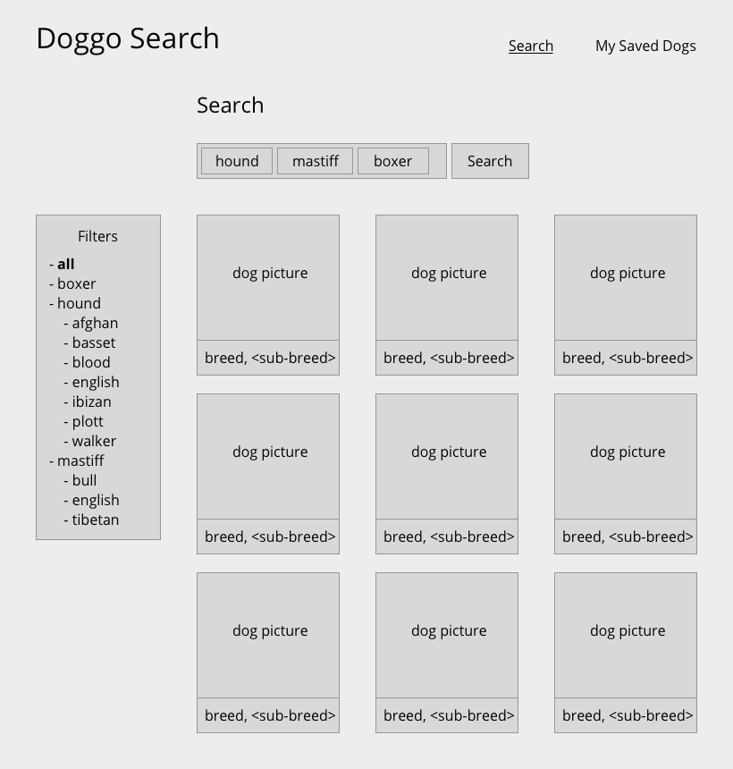
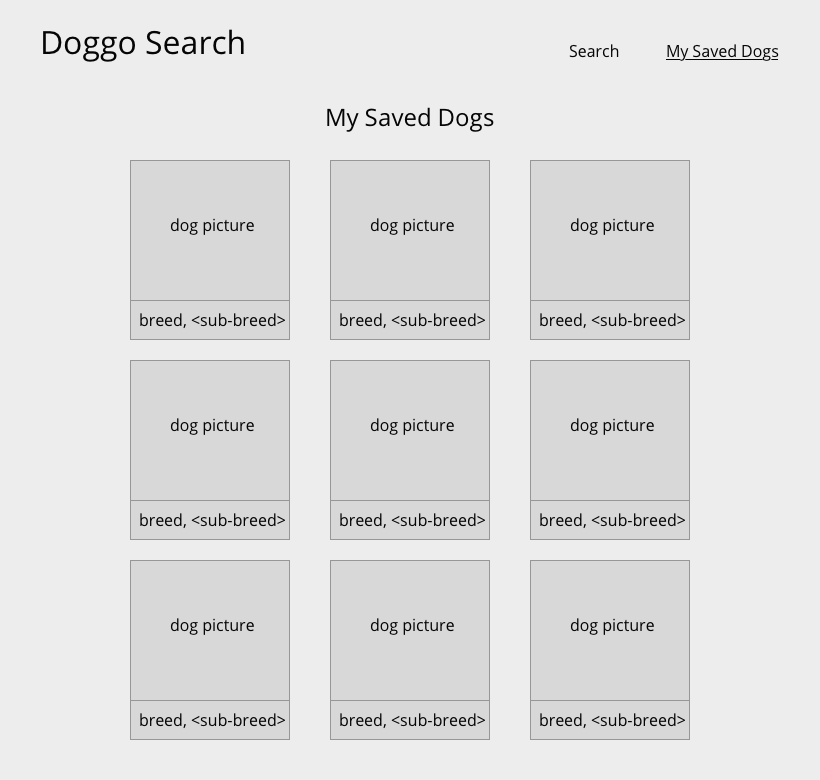

# Hub3 Take-Home Challenge: Doggo Search

## Preface

First, thanks for taking the time to complete our take-home
challenge. At Hub3, many of our projects have complex frontends
(and backends), so solid JavaScript and React fundamentals are
essential.

We want to be considerate of your time, so please take no longer
than three hours on this challenge. We're interested in seeing what
you can do within that time frame.

The goal of this challenge is for us to learn more about your
skills as a frontend developer. Like with our 'real' projects, in
this take-home you'll be given requirements and we're expecting
all features to be built well, use well, and look decent.

Good Luck!

## Challenge Overview

We want to build a simple app for finding our favorite dog breed!
It should be a browser app only, with no backend component.

It will have two primary views:

- Search
- My Saved Dogs (bonus)

How Doggo Search works at a high-level: You can search for
pictures of dogs by breed, filter the results by sub-breed, and
save the pictures you like.

Notes:

- Your solution does NOT need tests, but feel free to add them.
- Your solution does NOT need to be mobile friendly, but it's great if it is.

## Dog API

For pictures of dogs, use the Dog API: https://dog.ceo/dog-api/

It's very simple and there are only five endpoints. You'll have
to consult the documentation to complete the requirements below.

## Development

To get you going quickly, we've provided a frontend project
scaffold with
[create-react-app](https://github.com/facebook/create-react-app).
All you need is a modern [Node](https://nodejs.org/en/)
installation and [yarn](https://yarnpkg.com/) to get started.

This environment comes with:

- automatic code reloading
- ES6
- JSX
- [Ant Design](https://ant.design)
  - Like Bootstrap, it includes a lot of components to get you going quickly.

Run `yarn install` to install dependencies.

Run `yarn start` to begin development.

- Open [http://localhost:3000](http://localhost:3000) to view it in the browser.
- This is also how we'll run your app and test it.

## Feature: Search

### Context: When a search query is present

- As the user types in the search input, dog breeds that match the search should be shown.
  - Consider Ant Design's 'multiple selection' Select: https://ant.design/components/select/
- Up to five breeds can be searched for at once, but no more.
- The search results should randomly intersperse pictures of the matching breeds.
- Each search result row should contain three search result items.
  - Each search result item should include:
    - dog picture
    - dog breed type
    - dog sub-breed type, if available
- The left sidebar consist of filters for the search results.
  - For instance, if the search query is "hound mastiff boxer", show this list:
    - all
    - boxer
    - hound
      - afghan
      - basset
      - blood
      - english
      - ibizan
      - plott
      - walker
    - mastiff
      - bull
      - english
      - tibetan
  - Clicking on either the breed or sub-breed should filter all search results to only those that match the filter.
  - Clicking on 'all' clears all filters. It's also the default filter.
  - Notice that breeds are listed in alphabetical order
- Search results should never show more than 12 search result items.
  - Implement pagination however you like—a simple Previous and Next button are fine.

Notes:

- When searching for multiple breeds at once, consider using [promises](https://developer.mozilla.org/en-US/docs/Web/JavaScript/Reference/Global_Objects/Promise). Feel free to implement however you like, though.
  - The `await / async` syntax is also fine if you prefer that.

### Context: When a search query is NOT present

- Show a random set of 12 dog pictures of any breed.
- Do not show the filter sidebar.

## Feature: My Saved Dogs

**This is a bonus feature.** You don't have to implement it—we
won't hold it against you if you don't. This is an opportunity to
go the extra mile if you have time. (timebox: 45 minutes)

- If you find a dog picture you like in the Search view, you should be able to save that picture to your My Saved Dogs list.
  - We'll leave the details up to you.
- In the My Saved Dogs view, you should simply be able to see all your saved dogs.
- Pagination should behave identical to the Search view's.
- That's it!

Notes:

- Storing My Saved Dogs in memory is fine. Don't worry about databases or Local Storage.

## Technologies

- Build this app with JavaScript only (using modern ES6).
- Must use React.
- Optional:
  - Ant Design for UI components.
- State management is up to you.
  - React state is fine. (We use Redux + Redux Saga for most projects.)
- Handling Ajax requests is up to you—use whatever you like.
- Feel free to install any other dependencies you need.

## Grading

At Hub3, we care a lot about code quality. We want you to build
this feature as if it were a real feature for one of our clients.
When we're evaluating your code, we'll be taking into account
these things:

- Correctness
- Simplicity
- Readability
- Architecture
- Maintainability

In summary, try to write clean, simple code that you'd be proud
to share with others.

We've not included any designs on purpose. While not necessary,
it's great if an engineer has an eye for design. Do your best to
make the final product polished and aesthetically pleasing.

## Submitting

With your solution, include a README with answers to these questions:

- What challenges did you face?
- What would you do differently with more time?
- Is there anything we should take note of as we review this code?

After, zip up your project and email it to the recruiter you're
working with. Good luck! :)

## Challenges

- I'm more used to work with Material-UI but I did enjoyed to try the Ant Design UI. I took me a little bit more of time, but it was an opportunity to learn a different library.
- To be honest, I started using NextJS instead of the create-react-app and it seems to me that it could be more reliable for an application like this.
- I added ESLINT, PropTypes, and Prettier.
- I wasn't able to improve the test coverage because I'm still recovering.

## Online Version

- https://eduardosmoura-hub3.vercel.app/
